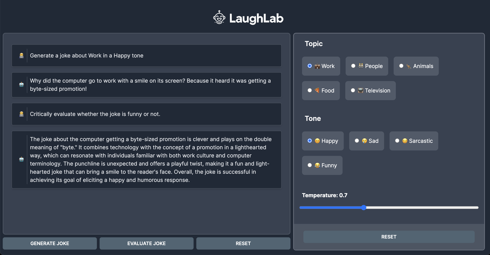

# LaughLab
**Encode - AI Bootcamp - Week 2 Project**

This project implements a simple Next.JS application that utilises Vercel's AI SDK to generate jokes based on some user configurable settings. It calls an OpenAI API so it can be used with OpenAI itself or any other LLM API that implements the OpenAI Completion API interface.



## Group Members' IDs
- **76tsNrC**
- **ipJZCWC**
- **s0qmoqC**
- **3nmWtwC**
- **XLiUjNC**

## Get Started

### Cloning the Repository

Clone the repo
```
git clone https://github.com/lorenzosattachiris/LaughLab && cd LaughLab
```

Install dependencies
```
npm ci
```

In order for the application to work you will have to setup environment variables for OpenAI API. these can be set directly in your terminal or via a `.env` file. See [.env.example](./.env.example) for an example.
```
OPENAI_KEY="sk..." # OpenAI API Key
BASE_URL='http://127.0.0.1:5000/v1' # OpenAI API Base URL - delete this line to use OpenAI official API
```

Run NextJS
```
npm run dev 
```

